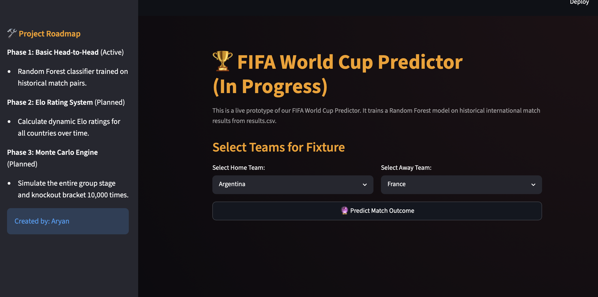

# FIFA World Cup Predictor & Simulator 🏆 (In Progress)

A data-driven FIFA World Cup 2026 prediction system combining Machine Learning, Elo Ratings, and Monte Carlo Simulation.

The project currently uses a Random Forest Classifier trained on historical international football results to predict head-to-head match outcomes. Future updates will introduce dynamic Elo ratings and a 10,000-run Monte Carlo tournament simulation engine to estimate qualification probabilities, knockout progression chances, and World Cup winning odds for every team.

🚧 Status: Active Development

This is a prototype of a FIFA World Cup Predictor. It currently features a basic machine learning model trained on historical World Cup matches and tournament qualifiers, with a clean Streamlit interface to predict individual matches.

This project is marked as **In Progress** as we work to build a full tournament simulation engine.

---

## 📂 Project Files

* **`results.csv`**: Raw dataset containing historical international match results from 1872 to the present.
* **`app.py`**: A Streamlit application that loads the dataset, filters for World Cup fixtures, trains a Random Forest Classifier on historical match pairs, and predicts win/draw/loss probabilities for any selected teams.
* **`README.md`**: Project documentation and development roadmap.

---

## ⚡ Setup & Run

### 1. Install dependencies
```bash
pip install streamlit pandas scikit-learn
```

### 2. Launch the Web UI
```bash
streamlit run app.py
```

---
## 📸 Current Prototype

### FIFA World Cup Predictor Interface


---

### ✅ Current Features

- Random Forest-based head-to-head match prediction
- Historical international football results dataset
- Interactive Streamlit web interface
- Match outcome probability estimation

### 🚀 Upcoming Features (Development Roadmap)

- Dynamic Elo Rating System
- Team strength modeling
- Full FIFA World Cup group-stage simulation
- Knockout bracket generation
- 10,000-run Monte Carlo tournament simulation
- Qualification and championship probability forecasting

---

## 👨‍💻 Author

Aryan
